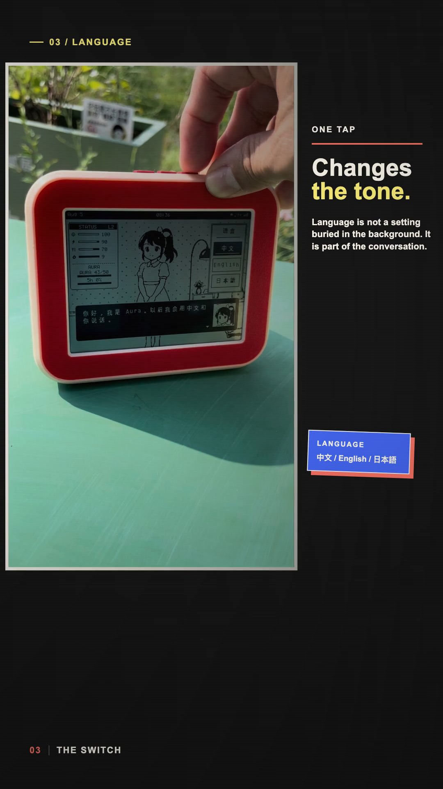
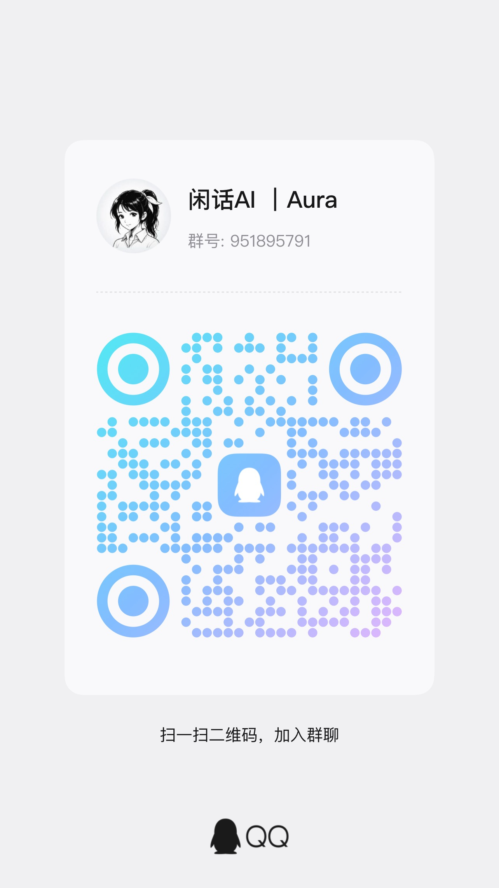

# Aura Lily

[简体中文](README.md) | [English](README.en.md) | [日本語](README.ja.md)

> An open-source voice companion that lives on your desk: it listens, speaks, shows its state, and moves through a day of its own.

Aura Lily is built for the Waveshare ESP32-S3-RLCD-4.2. It is not a chat window squeezed onto a small display. It joins voice turns, character state, scenes, and a daily rhythm in a self-hosted ESP32-S3 device. The device handles recording, sound, display, and local interaction; your own service handles the voice pipeline, model calls, and the optional world state.

## Demo

<p align="center">
  <a href="docs/media/AuraHero-v13-full-english-answer.mp4">
    
  </a>
</p>

<p align="center">
  Open the 58-second demo from the cover, or <a href="docs/media/AuraHero-v13-full-english-answer.mp4">download the MP4</a>. A <a href="https://youtube.com/shorts/B0PyZoMU2sw">YouTube Short</a> is available as well.
</p>

GitHub README rendering does not reliably provide an inline video player, so the demo uses the same robust pattern used by many open-hardware projects: a clickable poster linked to a repository-hosted video.

## What makes it different

- **Conversation is tied to state.** Aura has mood, energy, satiety, stress, affinity, and beans. Talking, eating, resting, spending, and completing scheduled activities change parts of that state.
- **A day is not a fixed script.** The world layer keeps five daily anchors (wake, three meals, and nightly wind-down), then generates four to eight dynamic activities from time, weather, mood, energy, satiety, stress, affinity, and funds.
- **Language is a complete route.** Chinese, English, and Japanese UI text, ASR results, replies, and TTS output follow the active conversation language together.
- **The device is part of the experience.** The 400 x 300 reflective 1-bit display presents the character, outfits, scenes, subtitles, status, and information board. Short local prompts do not need an extra TTS request.

## Included capabilities

| Area | What the public edition includes |
| --- | --- |
| Voice turns | Device recording, Opus uplink, ASR, streamed text replies, and TTS audio return. Captions progress with actual audio playback. |
| Three languages | Chinese, English, and Japanese UI and speech routing, including localized quota prompts. |
| Everyday world | Optional state, schedule, and world layer. Scheduled meals, rest, outings, and purchases settle real state effects. |
| Local networking | Two saved Wi-Fi credential slots with real SSID labels and manual switching. |
| OTA | Dual application partitions, application and asset OTA, SHA-256 verification, and boot rollback. An old single-partition device needs one complete wired flash before its first OTA migration. |
| Self-hosting | A local admin UI for Hermes, the dialogue model, ASR, TTS, dialogue quota, and an optional Soul. Public builds have no baked-in server endpoint. |

## Architecture

```text
ESP32-S3 device
  microphone / buttons / RLCD / speaker
            | WebSocket
            v
Aura Lily gateway
  ASR -> conversation model -> TTS
            |
            +-- optional Aura state and daily-world layer
```

Run the service on a computer, NAS, or server you control. Choose and configure your own model and voice providers. The device must use a LAN, Tailscale, or public address, never `127.0.0.1`.

## Quick start

### 1. Start the service

Requirements: Python 3.11+, Docker Compose, and a configured `hermes` CLI or an OpenAI-compatible model endpoint. Firmware builds need ESP-IDF 5.x.

```bash
cp .env.example .env
docker compose up --build
```

Verify it from another terminal:

```bash
curl -s http://127.0.0.1:8765/health
```

The default HTTP/admin port is `8765`; the ESP32 WebSocket gateway listens on `8787`. Configure models, ASR, TTS, and the admin password at `http://<your-server-address>:8765/admin`. Model credentials stay in your local runtime environment and are not supplied by this repository.

### 2. Enable the optional world layer

The basic Hermes bridge runs on its own. To enable Aura state, scenes, and scheduling, set this in `.env`:

```bash
AURA_PERSONA_ENABLED=1
```

Soul starts empty. Add your own through the local admin UI or create `.docker/aura-persona/persona/soul.md`. State and schedules live in Git-ignored local runtime storage.

### 3. Build and flash the device

```bash
cd firmware/esp32
source "$HOME/esp/esp-idf/export.sh"
idf.py set-target esp32s3
idf.py menuconfig
idf.py build
idf.py -p /dev/cu.usbmodemXXXX flash monitor
```

Set your WebSocket and OTA manifest URLs in `menuconfig > Aura Lily`, or save them from the first-run provisioning page. Use your LAN, Tailscale, or public address instead of `127.0.0.1`.

### 4. Wi-Fi and OTA

Successful provisioning retains two Wi-Fi credentials and shows their SSIDs in the device menu. The public build has no default OTA server. Configure your own HTTPS manifest URLs in `menuconfig > Aura Lily`, then use `tools/make_ota_release.py` to create firmware and asset manifests. Upload all artifacts before publishing `manifest.json`.

For the detailed Hermes bridge contract and smoke test, read the [Hermes bridge guide](integrations/hermes_lily_cli/README.md).

## Repository layout

```text
firmware/esp32/                     ESP32-S3 firmware, display, audio and local assets
integrations/hermes_lily_cli/       Hermes bridge, HTTP/WS gateway and local admin UI
integrations/aura_persona_gateway/  Optional Aura state, reminders, weather and world schedule
tests/                              Focused gateway, world, Wi-Fi, OTA and quota tests
tools/                              Asset, voice, diagnostics and OTA release tools
```

## Public scope and privacy

This is a separately curated **public no-RAG release**. It does not include, and cannot be restored by checking out older public commits:

- RAG, knowledge-base routing, vector-database connections, or semantic long-term memory;
- the maintainer's Soul/persona, chat databases, runtime state, identity data, or API keys;
- private domains, IP addresses, SSIDs, OTA URLs, production-service settings, or deployment files.

Local state, recent turn context, and schedules are operational device data, not a knowledge base or semantic long-term memory. Keep `.env`, `.docker/`, device backups, and build artifacts private in your own environment.

## Verify

```bash
python3 -m pytest -q
```

Before publishing firmware, also run `idf.py build` and confirm that the application image fits a `0x280000` OTA partition.

## Community

For hardware ports, deployment, character assets, and self-hosting discussion, join the "Xianhua AI | Aura" QQ group: `951895791`.

<p align="center">
  
</p>
